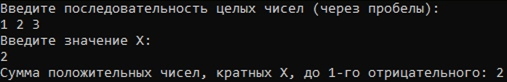
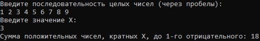
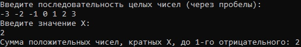
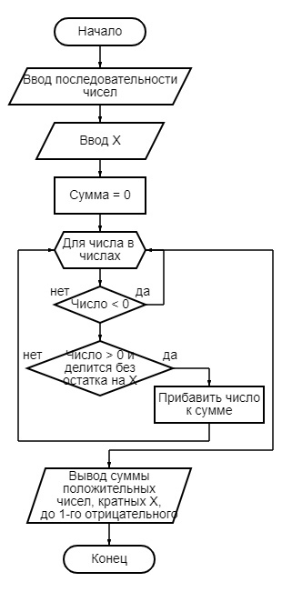

# Домашняя работа
**1.** Вводится последовательность целых чисел. Определить сумму положительных чисел, кратных заданному числу Х, до первого отрицательного.
____

Рис. 1 - вывод программы

Рис. 2 - вывод программы

Рис. 3 - вывод программы

Рис. 4 - блок-схема